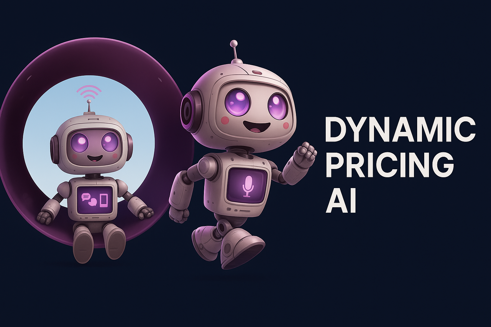

# FluxPricer

FluxPricer is a chat-first dynamic pricing platform: you talk to it in natural language, and it runs an internal multi-agent workflow — market data collection, pricing algorithms, and proposal logging — communicating over an in-process event bus, with the results surfaced back in the conversation.

  

## Problem statement

Sellers who want to react to competitor price moves have to manually check competitor sites, decide on a new price, and reason about margin impact. FluxPricer explores whether a conversational interface backed by a small set of cooperating agents can do that loop for a single SKU: collect competitor prices, run a pricing algorithm, and produce an auditable price proposal — without hand-built dashboards or cron jobs.

## Architecture

The backend (`backend/main.py`) starts a small set of long-running agents in its FastAPI `lifespan`, which communicate through an in-process event bus (`core/events`) rather than direct function calls:

- **`PricingOptimizerAgent`** (`core/agents/price_optimizer/agent.py`) — subscribed to `OPTIMIZATION_REQUEST`
- **`DataCollectorAgent`** (`core/agents/data_collector/agent.py`) — polls for market data on a timer (every 3 minutes)
- **`ProposalLogger`** (`core/agents/proposal_logger.py`) — subscribed to `PRICE_PROPOSAL`, persists proposals to SQLite
- The alert service (`core/agents/alert_service/api.py`) is also started

The `UserInteractionAgent` (`core/agents/user_interact/user_interaction_agent.py`) is **not** one of the long-running lifespan agents — it is instantiated per chat request inside `backend/routers/streaming.py` to handle that request's SSE stream, and it publishes onto the same event bus to reach the running agents.

### Agent responsibilities

| Agent | Where it lives | Responsibility |
| --- | --- | --- |
| `UserInteractionAgent` | `core/agents/user_interact/user_interaction_agent.py` | Handles one chat turn: streams the LLM response over SSE, and calls tools (e.g. `optimize_price`) when the model decides to. Created per-request, not a lifespan agent. |
| `PricingOptimizerAgent` | `core/agents/price_optimizer/agent.py` | Subscribes to `OPTIMIZATION_REQUEST` on the event bus; picks and runs a pricing algorithm; publishes a `PRICE_PROPOSAL` event. |
| `DataCollectorAgent` | `core/agents/data_collector/agent.py` | Runs on a timer, refreshing competitor/market data used by the optimizer. |
| `ProposalLogger` | `core/agents/proposal_logger.py` | Subscribes to `PRICE_PROPOSAL`; writes each proposal to the `price_proposals` table in SQLite. |
| Alert service | `core/agents/alert_service/api.py` | Started alongside the other agents in `lifespan`; evaluates alert conditions. |

### End-to-end demo flow

1. User sends a chat message. `UserInteractionAgent` streams a response over SSE, using whichever LLM provider is configured (see below).
2. If the model decides pricing action is needed, it calls the `optimize_price` tool (`core/agents/user_interact/tools.py`), which publishes an `OPTIMIZATION_REQUEST` event on the bus.
3. `PricingOptimizerAgent` receives the event, selects one of three algorithms — `rule_based`, `volatility_adjusted` (with `ml_model` alias), or `profit_maximization` (`core/agents/price_optimizer/algorithms.py`) — via either an LLM-based decision or a heuristic fallback, and computes a proposed price.
4. The optimizer publishes a `PRICE_PROPOSAL` event.
5. `ProposalLogger` persists the proposal to the `price_proposals` table in SQLite.
6. The proposal is visible back in the chat: the `list_price_proposals` tool (`core/agents/user_interact/tools.py`) lets the user ask a follow-up like "what did you propose?" and get the logged result.

### LLM providers

Providers are registered from environment variables in `core/agents/llm_provider_manager.py`. Whichever are configured are tried in this order, falling back to the next on failure:

| Provider | Default model | Notes |
| --- | --- | --- |
| Gemini | `gemini-2.5-flash` (and `gemini-2.5-pro` registered separately) | `GEMINI_API_KEY`, plus optional `GEMINI_API_KEY_2`/`_3` for extra fallback keys |
| OpenRouter | `z-ai/glm-4.5-air:free` | Free-tier model; `OPENROUTER_API_KEY` |
| OpenAI | `gpt-4o-mini` | `OPENAI_API_KEY` |

If a provider errors mid-stream, `LLMClient` (`core/agents/llm_client.py`) retries the next registered provider automatically. If no provider is configured at all, chat still works with a fixed non-LLM fallback response.

## Scope & honesty notes

- **The Prices panel in the UI is simulated data**, not live output of the agent pipeline — `backend/routers/prices.py`'s `/api/prices/stream` endpoint generates a random walk (`random.choice`, `random.uniform`) for visual effect. Real price proposals produced by the agent pipeline described above are stored in SQLite and are visible by asking the chat, not in this panel.
- Competitor data collection (`core/agents/data_collector/connectors/web_scraper.py`) does perform real HTTP requests and HTML parsing (`requests` + `BeautifulSoup`) against configured competitor URLs — it is not simulated, but it depends on the target page's markup and is not a hardened scraper.

## Tech stack

- **Backend**: FastAPI, SQLAlchemy, SQLite, an in-process pub/sub event bus (`core/events`)
- **Frontend**: React 18 + TypeScript, Vite, Tailwind CSS, Zustand
- **LLM access**: `openai` Python SDK used against OpenRouter, OpenAI, and Gemini's OpenAI-compatible endpoint

## Setup

See [docs/SETUP.md](docs/SETUP.md) for installation, environment variables, and how to run the app.

## License

MIT — see [LICENSE](LICENSE).
